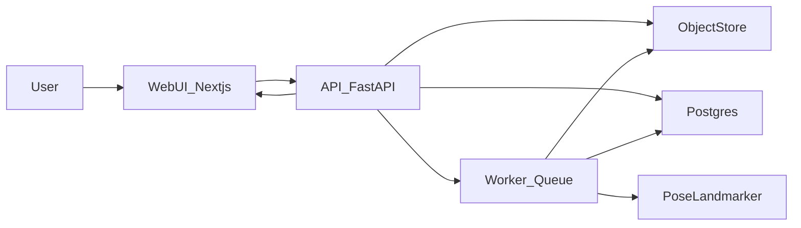

# Pedi-Growth: Full Program Analysis and Revamp Blueprint

## Executive summary
Pedi-Growth is a proof-of-concept Streamlit app that performs basic pediatric gait analysis on uploaded videos. It uses MediaPipe Pose Landmarker to detect body landmarks frame-by-frame, computes left/right knee flexion angles, displays a live annotated feed and angle chart, and calculates a simple symmetry score based on max knee flexion. The intended positioning (per the hackathon narrative) is a local-first triage tool for community health workers in resource-constrained settings, but the current implementation is still a demo and is not production-ready: it lacks robust error handling, data validation, temporal smoothing, clinical calibration, persistence, and testing coverage. A production web app should keep Python for inference (MediaPipe integration) and move to a service architecture with a modern frontend and a dedicated processing backend.

## Hackathon context and intended positioning (provided narrative)
The project narrative frames Pedi-Growth as a local-first diagnostic triage tool for Bangladesh, aimed at early detection of Cerebral Palsy and developmental delays using a standard smartphone video. The stated goals are fast triage (under 60 seconds), no cloud dependency, and a simple UI for community health workers.

Key points from the narrative:
- **Target context**: Resource-constrained environments, long specialist wait times.
- **Problem framing**: High rates of developmental delays and late diagnosis.
- **Solution**: Quantify gait asymmetry from smartphone video to triage patients.
- **Local-first**: Run on localhost with no cloud dependency.
- **Vision engine**: MediaPipe Pose skeleton tracking.
- **Optimization hack ("SAM 3 Protocol")**: Offline background removal on demo videos, with code swapping pre-processed videos for instant results.
- **Operational guardrails**: No login, no live webcam, no cloud, single maintainer for main file to avoid merge issues.
- **Hackathon timeline**: 48-hour sprint with phases (setup, engine, optimization, dashboard).

## Alignment with the current codebase (what is implemented vs narrative)
Implemented in code:
- Local Streamlit UI with video upload.
- Frame-by-frame pose detection with MediaPipe.
- Knee angle computation from hip-knee-ankle landmarks.
- Live annotated video and time-series chart.
- Symmetry score (based on max flexion) and a high-risk alert if below 0.85.

Not implemented in code (as of now):
- **"SAM 3 Protocol"** background removal and video swapping logic.
- **Patient ID** field or triage workflow UI.
- **Explicit local-first constraints** beyond the default local Streamlit run.
- **Symmetry Index (SI) formula** defined as max(ROM_left) / max(ROM_right).
  - Current code uses min(max_left, max_right) / max(max_left, max_right), so the value is always <= 1.0.
  - The narrative threshold of SI > 1.15 is therefore not possible with the current implementation.
- **Diagnosis label logic** based on >15 percent asymmetry; current code uses a <0.85 threshold.

## What the program is doing (end-to-end)
1. **UI startup**: Streamlit configures a wide layout and renders a sidebar file uploader for video files (`.mp4`, `.mov`).
2. **Model init**: `GaitScanner` is constructed and loads the MediaPipe pose landmarker task file from disk.
3. **Video processing loop**:
   - The uploaded video is written to a temporary file.
   - OpenCV reads frames in a loop.
   - Each frame is processed by `GaitScanner.process_frame()`:
     - Frame is converted from BGR to RGB.
     - MediaPipe Pose Landmarker detects pose landmarks (first pose only).
     - Left/right hip, knee, ankle landmarks are extracted.
     - Face landmarks (0–10) are used to build a bounding box and blur the face for privacy.
     - Left/right knee angles are computed using a 2D angle formula.
     - Overlay lines and joints are drawn on the frame.
     - If the left/right angle delta exceeds 30 degrees, an "ASYMMETRY ALERT" text is drawn.
4. **Live display**: Streamlit updates the annotated frame and line chart of left/right knee angles.
5. **Post-analysis report**:
   - Angles of 0 or None are filtered out.
   - Max flexion for left/right is computed.
   - `symmetry_score = min(max_left, max_right) / max(max_left, max_right)`.
   - If symmetry score < 0.85, the app shows a high-risk alert.

## Model understanding (as used here)
The app uses MediaPipe Pose Landmarker (Tasks API) with a local task file (`pose_landmarker_heavy.task`). It returns normalized landmark coordinates (x, y, z, and visibility), but this code uses only **x and y**. The knee angle calculation is therefore a **2D projection**, not a true 3D joint angle. The landmarker is run in **IMAGE mode**, which treats each frame independently and does not apply temporal tracking.

Important implications:
- **No temporal smoothing**: outputs can be jittery frame-to-frame.
- **2D geometry**: camera angle, distance, and perspective can distort angles.
- **Single-person**: only the first detected pose is used.
- **Face blur** is heuristic (bounding box from landmarks 0–10) and may fail if the face is not detected or is occluded.

## Key computed metrics
- **Left/Right Knee Flexion**: computed from hip–knee–ankle triangle using `arctan2`.
- **Angle formula (as implemented)**:
  - theta = arctan2(Cy - By, Cx - Bx) - arctan2(Ay - By, Ax - Bx)
  - converted to degrees and normalized to <= 180
- **Symmetry Score**: ratio of the smaller max flexion to the larger max flexion.
  - This is **not clinically calibrated** and should be treated as a rough heuristic.
  - No normalization by leg length, walking speed, or calibration markers.
  - Narrative SI definition differs: SI = max(ROM_left) / max(ROM_right) with asymmetry thresholds < 0.85 or > 1.15.

## Missing pieces and why the app feels incomplete
### Reliability and robustness
- No input validation for video length, resolution, or orientation.
- No handling for corrupt videos, short clips, or camera rotation.
- Assumes a clear, unobstructed view of the lower limbs.

### Model and signal quality
- IMAGE mode ignores temporal continuity; output is jittery.
- No smoothing or filtering (moving average, Savitzky-Golay).
- Angles are 2D, not biomechanically accurate 3D joint angles.
- No calibration or camera pose estimation.

### Clinical readiness
- Symmetry threshold (0.85) and alert threshold (30°) are arbitrary.
- No clinical reference ranges, age normalization, or validation dataset.
- No reporting of confidence or uncertainty.

### Product and engineering gaps
- No persistent storage for results or data export (PDF/CSV).
- No background processing for long videos.
- No logging, error telemetry, or monitoring.
- Minimal tests (only one angle test).
- No documentation for setup, model file placement, or deployment.

## Stack recommendation (production web app)
**Recommended stack**: **React/Next.js frontend + Python FastAPI backend + worker queue**  
Reasoning:
- MediaPipe and current inference code are Python-native and stable.
- FastAPI supports async APIs, file uploads, and background jobs.
- A worker system (Celery/RQ) prevents long video processing from blocking API responses.
- Next.js provides a robust UI for upload, progress, and results visualization.

**Alternative (all-JS)**: Use MediaPipe Web or TF.js in the browser. This can reduce backend complexity but is riskier for video processing scale, model updates, and reproducibility.

**Bottom line**: keep Python for inference and move to a service architecture for production reliability.

## Revamped architecture (production-ready)

### Proposed repo layout
- `frontend/` – Next.js UI (upload, status, charts, report)
- `backend/` – FastAPI API for upload + job control
- `worker/` – background video processing pipeline
- `models/` – model task files + versioning
- `shared/` – data schemas, utilities, and report templates
- `docs/` – deployment + clinical interpretation notes

## Revamped processing pipeline (what to build)
1. **Upload video** → store in object storage.
2. **Queue processing job** → return job ID immediately.
3. **Process video in VIDEO mode** with timestamps:
   - temporal tracking enabled by MediaPipe
   - smoothing filters for angle signals
4. **Compute richer metrics**:
   - max/min flexion, range of motion
   - asymmetry over time (not only max)
   - cadence proxy (step periodicity)
5. **Persist results** to DB and generate a report artifact (PDF/JSON).
6. **Return results** to UI for visualization and download.

## Tests, validation, and quality gates
### Unit tests
- Angle calculation with multiple configurations.
- Landmark index mapping (left/right).
- Missing landmark handling.

### Integration tests
- Short sample video with expected output shape.
- End-to-end job execution with mocked model.

### Observability
- Structured logs (frame count, detection rate).
- Error reporting with job IDs.
- Performance metrics (FPS, job duration).

## Deployment and run steps (production)
- Containerize backend/worker with Docker.
- Use object storage (S3-compatible) for video artifacts.
- Use Postgres for job metadata + results.
- Configure environment variables for model path and storage.
- Add CI pipeline for lint/test/build/deploy.

## Smoke test checklist (execution guide)
1. Start backend and worker locally.
2. Upload a short gait video (10–15 seconds).
3. Confirm job transitions: `queued → processing → done`.
4. Verify:
   - Processed frames were generated.
   - Angle arrays are non-empty and stable.
   - Symmetry score is returned and rendered in UI.
5. Download the report artifact and inspect for correctness.

## Summary of what must be done to make it “complete”
- Replace Streamlit prototype with a web UI + backend service.
- Move inference into a background worker with job tracking.
- Use VIDEO mode + smoothing for stable signals.
- Expand metrics beyond max flexion and document interpretation.
- Add tests, validation data, and deployment runbooks.

