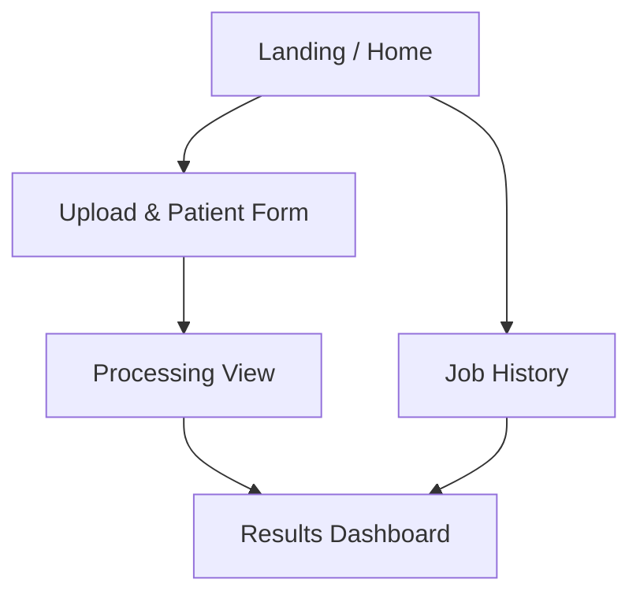
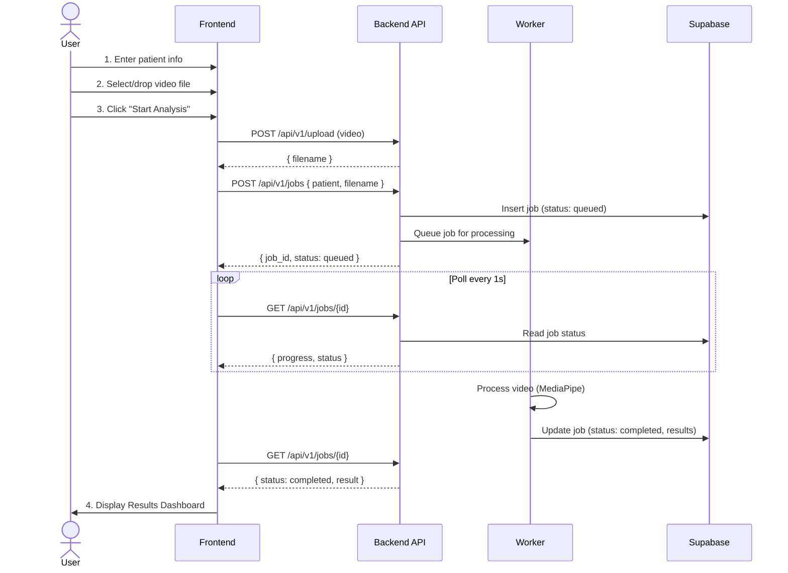
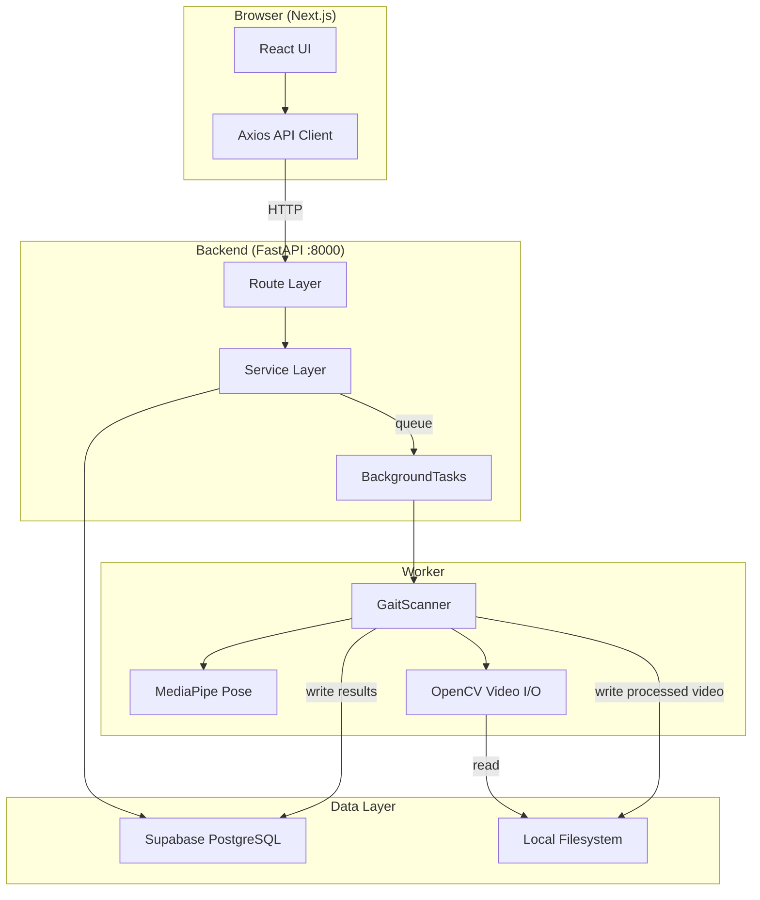
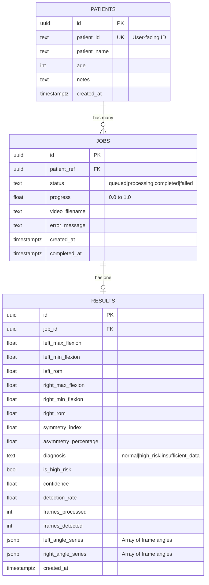
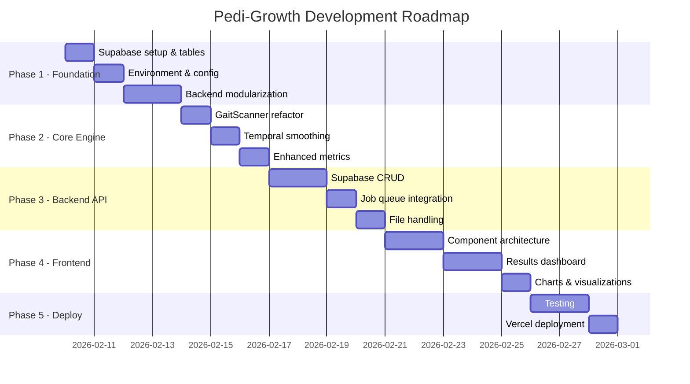

# Pedi-Growth — Technical Design Document (TDD)

---

## 1. Executive Summary

### Problem Statement
In Bangladesh and similar resource-constrained settings, **cerebral palsy (CP)** and developmental delays affect roughly **3.4 per 1,000 live births**. Most children are diagnosed late — often after irreversible damage — because specialized gait labs cost **$50,000+** and the nearest specialists can be **hours away**. Community health workers (CHWs) have no quantitative tool to screen children quickly.

### Proposed Solution
**Pedi-Growth** is a **browser-based pediatric gait analysis tool** that converts a standard smartphone video of a child walking into an objective symmetry report in under 60 seconds. It uses **MediaPipe Pose Landmarker** to extract body landmarks frame-by-frame, computes **clinically-relevant gait metrics**, and delivers a triage-level risk assessment.

### Target Audience

| Persona | Need |
|---------|------|
| Community Health Workers (CHWs) | Quick, no-login screening tool during home visits |
| Pediatricians / Physiotherapists | Objective data to track treatment progress |
| Parents | Shareable visual report to bring to specialist visits |
| Researchers | Exported datasets for population studies |

### Key Differentiators
- **Local-first**: Runs offline; no cloud dependency for processing
- **Zero login**: Open access, no authentication barrier
- **Sub-60-second triage**: Upload → result in under a minute
- **Privacy-preserving**: Face auto-blur, no video stored permanently

---

## 2. Functional Requirements (The "What")

### User Roles
Since the app is **open access**, there is a single implicit role:

| Role | Access |
|------|--------|
| **Operator** (CHW, clinician, parent) | Full access: upload, analyze, view, export |

> No login, no role-based restrictions for MVP.

### Core Features

#### MVP (Must-Have for Launch)

| # | Feature | Description |
|---|---------|-------------|
| F1 | **Video Upload** | Drag-and-drop or file picker for MP4/MOV/AVI (≤100 MB, 5–60 sec) |
| F2 | **Gait Analysis Engine** | MediaPipe pose detection → knee angle extraction → symmetry calculation |
| F3 | **Real-time Progress** | Live progress bar during processing with frame count |
| F4 | **Results Dashboard** | Visual display of key metrics: SI, asymmetry %, ROM, detection rate |
| F5 | **Risk Classification** | Normal / High Risk / Insufficient Data with color-coded banner |
| F6 | **Angle Time-Series Chart** | Left vs Right knee flexion over time (Recharts) |
| F7 | **Job History** | List of past analyses persisted in Supabase |
| F8 | **Face Privacy Blur** | Auto-detect and blur face in processed video |
| F9 | **Patient Info Form** | Patient ID, name, age, notes (minimal fields) |

#### Post-MVP (Future Phases)

| # | Feature | Description |
|---|---------|-------------|
| F10 | PDF Report Export | Downloadable clinical report with charts + diagnosis |
| F11 | Processed Video Playback | View annotated skeleton overlay on video |
| F12 | Longitudinal Tracking | Compare multiple sessions for same patient over time |
| F13 | Age-Normalized Scoring | Reference ranges adjusted by child age/gender |
| F14 | Cadence Detection | Step timing and stride periodicity |
| F15 | Multi-Joint Analysis | Hip and ankle angles in addition to knee |

---

## 3. User Interface & Experience (UI/UX)

### 3.1 Sitemap



| Page | Path | Description |
|------|------|-------------|
| **Home** | `/` | Upload form + patient info + recent history |
| **Processing** | `/` (modal/inline) | Progress bar, frame counter |
| **Results** | `/results/[jobId]` | Full metrics, chart, diagnosis, export |
| **History** | `/history` | Table of past analyses with status |

### 3.2 User Flow — Primary (Upload-to-Result)



### 3.3 Wireframe Descriptions

#### Home Page Layout
```
┌─────────────────────────────────────────────┐
│  🏥 Pedi-Growth | Clinical Gait Analysis    │
├──────────────┬──────────────────────────────┤
│              │                              │
│  Patient ID* │     [No Analysis Yet]        │
│  [________]  │                              │
│              │     Upload a gait video       │
│  Name        │     to begin analysis.        │
│  [________]  │                              │
│              │                              │
│  Age         │                              │
│  [________]  │                              │
│              │                              │
│  ┌────────┐  │                              │
│  │  📁    │  │                              │
│  │ Upload │  │                              │
│  │ Video  │  │                              │
│  └────────┘  │                              │
│              │                              │
│ [Start]      │                              │
├──────────────┴──────────────────────────────┤
│  Recent Analyses: [ job1 | job2 | job3 ]    │
└─────────────────────────────────────────────┘
```

#### Results Dashboard Layout
```
┌─────────────────────────────────────────────┐
│  ✅ NORMAL  |  SI = 1.02  |  Confidence 90% │
├──────────────────────────────────────────────┤
│  ┌─────────┐ ┌─────────┐ ┌─────────┐       │
│  │ L-Max   │ │ R-Max   │ │ Asym %  │       │
│  │ 130.2°  │ │ 128.1°  │ │  1.6%   │       │
│  └─────────┘ └─────────┘ └─────────┘       │
├──────────────────────────────────────────────┤
│           📈 Angle Time-Series              │
│  ~~~~~~~~~~~~~~~~~~~~~~~~~~~~~~~~~~~~~~~~~~~│
│  Left ──── Right ----                        │
│                                              │
├──────────────────────────────────────────────┤
│  Detection Rate: 95%  |  Frames: 240        │
│  Left ROM: 10.2°  |  Right ROM: 9.8°        │
└──────────────────────────────────────────────┘
```

---

## 4. Technical Architecture (The "How")

### 4.1 Tech Stack

| Layer | Technology | Version | Rationale |
|-------|------------|---------|-----------|
| **Frontend** | Next.js + React | 14.x + 18.x | SSR, great DX, file-based routing |
| **Styling** | TailwindCSS | 3.4.x | Utility-first, already configured |
| **Language** | TypeScript | 5.x | Type safety on frontend |
| **Backend** | Python + FastAPI | 3.11+ / 0.100+ | Async, type-safe, ML-native |
| **Database** | Supabase (PostgreSQL) | Latest | Managed Postgres, real-time, free tier |
| **Video Processing** | MediaPipe + OpenCV | Latest + 4.x | Google-backed pose detection |
| **Charts** | Recharts | 2.10.x | Already a dependency |
| **Icons** | Lucide React | Latest | Already a dependency |
| **Deployment** | Local → Vercel (FE) | — | Frontend on Vercel, backend local/cloud |
| **File Storage** | Local filesystem | — | `uploads/`, `results/` directories |

### 4.2 System Architecture



#### Key Architecture Decisions

| Decision | Choice | Why |
|----------|--------|-----|
| **Monolith vs Microservice** | Monolith with modular packages | Simpler for small team; microservice overhead not justified |
| **Processing model** | FastAPI `BackgroundTasks` | Simpler than Celery/Redis for MVP; upgrade path exists |
| **Database** | Supabase (remote PostgreSQL) | Managed, free tier, real-time subscriptions built in |
| **File storage** | Local filesystem | Simple for local dev; migration to S3/Supabase Storage later |
| **Auth** | None | Open access for CHWs; add later if needed |

### 4.3 Database Design (ERD)



#### Schema SQL

```sql
-- Enable UUID extension
CREATE EXTENSION IF NOT EXISTS "uuid-ossp";

-- Patients table
CREATE TABLE patients (
    id UUID PRIMARY KEY DEFAULT uuid_generate_v4(),
    patient_id TEXT UNIQUE NOT NULL,
    patient_name TEXT,
    age INTEGER CHECK (age >= 0 AND age <= 18),
    notes TEXT,
    created_at TIMESTAMPTZ DEFAULT NOW()
);

-- Jobs table
CREATE TABLE jobs (
    id UUID PRIMARY KEY DEFAULT uuid_generate_v4(),
    patient_ref UUID REFERENCES patients(id) ON DELETE CASCADE,
    status TEXT NOT NULL DEFAULT 'queued'
        CHECK (status IN ('queued', 'processing', 'completed', 'failed')),
    progress FLOAT DEFAULT 0.0
        CHECK (progress >= 0.0 AND progress <= 1.0),
    video_filename TEXT NOT NULL,
    error_message TEXT,
    created_at TIMESTAMPTZ DEFAULT NOW(),
    completed_at TIMESTAMPTZ
);

-- Results table
CREATE TABLE results (
    id UUID PRIMARY KEY DEFAULT uuid_generate_v4(),
    job_id UUID UNIQUE REFERENCES jobs(id) ON DELETE CASCADE,
    left_max_flexion FLOAT,
    left_min_flexion FLOAT,
    left_rom FLOAT,
    right_max_flexion FLOAT,
    right_min_flexion FLOAT,
    right_rom FLOAT,
    symmetry_index FLOAT,
    asymmetry_percentage FLOAT,
    diagnosis TEXT CHECK (diagnosis IN ('normal', 'high_risk', 'insufficient_data')),
    is_high_risk BOOLEAN DEFAULT FALSE,
    confidence FLOAT CHECK (confidence >= 0.0 AND confidence <= 1.0),
    detection_rate FLOAT,
    frames_processed INTEGER,
    frames_detected INTEGER,
    left_angle_series JSONB,
    right_angle_series JSONB,
    created_at TIMESTAMPTZ DEFAULT NOW()
);

-- Indexes
CREATE INDEX idx_jobs_status ON jobs(status);
CREATE INDEX idx_jobs_patient ON jobs(patient_ref);
CREATE INDEX idx_jobs_created ON jobs(created_at DESC);
CREATE INDEX idx_results_job ON results(job_id);
```

### 4.4 API Specification

**Base URL**: `http://localhost:8000`

#### Health

| Method | Endpoint | Description | Response |
|--------|----------|-------------|----------|
| GET | `/health` | Service health check | `{ status, timestamp }` |

#### Upload

| Method | Endpoint | Description | Request | Response |
|--------|----------|-------------|---------|----------|
| POST | `/api/v1/upload` | Upload video file | `multipart/form-data: file` | `{ filename, size_mb, upload_url }` |

**Validations**:
- Extension: `.mp4`, `.mov`, `.avi`, `.webm`
- Max size: 100 MB
- Returns 400 for invalid format/size

#### Jobs

| Method | Endpoint | Description | Request Body | Response |
|--------|----------|-------------|--------------|----------|
| POST | `/api/v1/jobs` | Create analysis job | `{ patient: { patient_id, patient_name?, age?, notes? }, video_filename }` | `{ job_id, status: "queued", message }` |
| GET | `/api/v1/jobs/{id}` | Get job status + result | — | `{ job_id, status, progress, result?, error_message? }` |
| GET | `/api/v1/jobs` | List all jobs | Query: `?status=&limit=50` | `[ { job_id, status, progress, ... } ]` |
| DELETE | `/api/v1/jobs/{id}` | Delete completed/failed job | — | `{ message }` |

#### Response Schemas

```json
// JobResponse
{
  "job_id": "uuid",
  "status": "queued | processing | completed | failed",
  "progress": 0.0,
  "result": {
    "job_id": "uuid",
    "patient": { "patient_id": "P001", "patient_name": "..." },
    "metrics": {
      "left_knee": { "max_flexion": 130.0, "min_flexion": 120.0, "range_of_motion": 10.0 },
      "right_knee": { "max_flexion": 128.0, "min_flexion": 118.0, "range_of_motion": 10.0 },
      "symmetry_index": 1.016,
      "asymmetry_percentage": 1.6,
      "frames_processed": 240,
      "frames_detected": 228,
      "detection_rate": 95.0
    },
    "diagnosis": {
      "result": "normal",
      "message": "Gait symmetry within normal clinical limits (SI=1.02).",
      "is_high_risk": false,
      "confidence": 0.90
    }
  }
}
```

### 4.5 Backend Module Structure

```
backend/
├── app/
│   ├── __init__.py
│   ├── main.py              # FastAPI app creation + middleware
│   ├── config.py             # Env vars, Supabase URL/key
│   ├── dependencies.py       # Shared deps (DB client)
│   ├── routes/
│   │   ├── __init__.py
│   │   ├── health.py         # GET /health
│   │   ├── upload.py         # POST /api/v1/upload
│   │   └── jobs.py           # CRUD /api/v1/jobs
│   └── services/
│       ├── __init__.py
│       ├── database.py       # Supabase client wrapper
│       ├── storage.py        # File I/O operations
│       └── processor.py      # Bridge to worker
├── requirements.txt
```

### 4.6 Engine Module Structure

The engine module lives inside `backend/app/engine/`:

```
backend/app/engine/
├── __init__.py
├── scanner.py            # GaitScanner class (MediaPipe)
├── analysis.py           # Metric calculations
├── smoothing.py          # Signal filtering (moving avg, Savitzky-Golay)
└── video.py              # OpenCV video I/O helpers
```

### 4.7 Frontend Module Structure

```
frontend/
├── src/
│   ├── components/
│   │   ├── Layout.tsx         # Page shell (header, footer)
│   │   ├── UploadForm.tsx     # Video + patient form
│   │   ├── ProgressBar.tsx    # Processing indicator
│   │   ├── DiagnosisBanner.tsx # Risk result banner
│   │   ├── MetricCard.tsx     # Single metric display
│   │   ├── AngleChart.tsx     # Recharts time-series
│   │   └── JobHistoryTable.tsx # Past analyses  
│   ├── pages/
│   │   ├── _app.tsx
│   │   ├── index.tsx          # Home (upload + results)
│   │   ├── results/[id].tsx   # Individual result page
│   │   └── history.tsx        # Job history page
│   ├── hooks/
│   │   ├── useJob.ts          # Job polling hook
│   │   └── useUpload.ts       # File upload hook
│   ├── services/
│   │   └── api.ts             # Axios client config
│   ├── types/
│   │   └── index.ts           # Shared TypeScript types
│   └── styles/
│       └── globals.css
├── package.json
├── tailwind.config.js
└── tsconfig.json
```

---

## 5. Clinical Analysis — Current vs Target

### 5.1 Current Metrics (What Exists)

| Metric | Formula | Issue |
|--------|---------|-------|
| Knee angle | `arctan2(C-B) - arctan2(A-B)` | 2D projection, camera-dependent |
| Symmetry score | `min(maxL, maxR) / max(maxL, maxR)` | Always ≤1, misses directionality |
| Alert threshold | `\|L-R\| > 30°` frame-by-frame | Arbitrary, not smoothed |
| Risk threshold | `SI < 0.85` | Not age-normalized |

### 5.2 Target Metrics (What We Build)

| Metric | Formula | Clinical Basis |
|--------|---------|----------------|
| **Symmetry Index** | `SI = maxROM_left / maxROM_right` | Preserves directionality (SI > 1.15 or < 0.85 = abnormal) |
| **Asymmetry %** | `\|1 - SI\| × 100` | Percentage deviation from perfect symmetry |
| **Range of Motion** | `max_angle - min_angle` per leg | Standard ROM metric |
| **Detection Rate** | `detected_frames / total_frames × 100` | Data quality indicator |
| **Confidence Score** | `f(detection_rate, asymmetry_magnitude)` | How reliable is this result? |

### 5.3 Signal Processing Improvements (Phase 2)

| Improvement | Method | Why |
|-------------|--------|-----|
| **Temporal smoothing** | Moving average (window=5) | Reduce frame-to-frame jitter |
| **Noise filtering** | Savitzky-Golay filter | Preserve peaks while smoothing |
| **Outlier rejection** | IQR-based detection | Remove impossible angles |
| **Zero handling** | Interpolate missing detections | Better continuity |

---

## 6. Non-Functional Requirements

### Security
| Requirement | Implementation |
|-------------|---------------|
| Face privacy | Auto-blur via MediaPipe face landmarks |
| No PII in URLs | UUIDs for all identifiers |
| Video cleanup | Auto-delete uploaded videos after 24 hours |
| HTTPS | Enforced on Vercel; optional locally |

### Performance
| Requirement | Target |
|-------------|--------|
| Video upload | < 5s for 100 MB file |
| Processing speed | < 60s for 15s video |
| API response time | < 200ms for reads |
| Dashboard render | < 2s initial load |

### Scalability
| Requirement | Strategy |
|-------------|----------|
| Concurrent users | FastAPI async handles 100+ concurrent |
| Database | Supabase scales automatically |
| Video storage | Local → Supabase Storage migration path |

### Accessibility
| Requirement | Implementation |
|-------------|---------------|
| Mobile responsive | TailwindCSS breakpoints |
| Color-blind safe | Red/green alternatives for risk indicators |
| Keyboard navigation | Semantic HTML + focus management |

---

## 7. Roadmap & Milestones



### Phase Summaries

| Phase | Deliverable | Duration |
|-------|-------------|----------|
| **1: Foundation** | Supabase tables, env config, modular backend structure | ~4 days |
| **2: Core Engine** | Improved GaitScanner with smoothing + better metrics | ~3 days |
| **3: Backend API** | Full CRUD with Supabase persistence + file handling | ~4 days |
| **4: Frontend** | Modern dashboard with charts, history, responsive UI | ~5 days |
| **5: Deploy** | Tests, Vercel deployment | ~3 days |
| **Total** | **Production-ready MVP** | **~20 days** |

---

## 8. Open Questions & Decisions Log

| # | Question | Status | Decision |
|---|----------|--------|----------|
| 1 | Database | ✅ Decided | Supabase |
| 2 | Auth | ✅ Decided | None (open access) |
| 3 | Deployment | ✅ Decided | Local + Vercel |
| 4 | File storage | ✅ Decided | Local filesystem |
| 5 | New Supabase project or reuse? | ✅ Decided | New project `pedi-growth` (ndsbxpfkrgplpyrbcohl) |
| 6 | Video auto-delete policy? | ✅ Decided | 24 hours |
| 7 | Max video duration? | ✅ Decided | 60 seconds |

