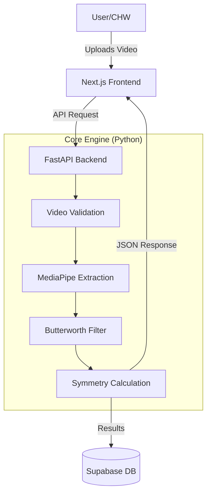

# Pedi-Growth — Program Overview & Flowchart

> **Executive Summary**: Pedi-Growth is an AI-powered pediatric gait analysis tool designed to screen for Cerebral Palsy (CP) and developmental delays using standard smartphone video. It provides accessible, objective motion analysis in under 60 seconds without requiring expensive gait labs.

---

## 1. What is It?

**Pedi-Growth** is a **"General Wellness" triage tool** that democratizes access to clinical-grade gait analysis.

*   **Problem**: Specialized gait analysis costs $50,000+ and requires expert labs, leading to late diagnosis of motor disorders in resource-constrained settings.
*   **Solution**: A web-based app that converts a normal 2D video into 3D skeletal data, extracting clinically relevant metrics like **Symmetry Index (SI)** and **Knee Range of Motion (ROM)**.
*   **Positioning**: It is **not** a diagnostic device. It is a screening aid for community health workers and parents to identify "High Risk" patterns that warrant specialist referral.

---

## 2. How It Works (The Core Logic)

The system follows a strict linear pipeline from video upload to clinical insight.

### High-Level Workflow

### Detailed Process Flow

1.  **Input & Validation**
    *   User uploads a video (MP4/MOV) of a child walking (side view).
    *   System validates: duration (5-60s), resolution (≥480p), and frame rate.

2.  **AI Skeletal Extraction (The "Engine")**
    *   **Model**: Google's **MediaPipe Pose Landmarker** (Heavy model).
    *   **Action**: Scans every frame to detect 33 3D body landmarks (hip, knee, ankle, toe, etc.).
    *   **Privacy**: Automatically detects faces and applies a privacy blur *before* any video is stored or displayed.

3.  **Signal Processing (The "Smoothing")**
    *   Raw AI data is jittery. We apply a **4th-order Butterworth Low-Pass Filter (6Hz cutoff)**.
    *   This removes noise while preserving the true biomechanical signal of the walking pattern.
    *   Missing data points (occlusions) are filled using cubic spline interpolation.

4.  **Clinical Analysis**
    *   **Knee Flexion**: Calculates the angle between Hip-Knee-Ankle for every frame.
    *   **Range of Motion (ROM)**: `Max Extension - Max Flexion` for both legs.
    *   **Symmetry Index (SI)**: `ROM_Left / ROM_Right`.
    *   **Diagnosis Logic**:
        *   `0.85 < SI < 1.15` → **Normal** (Green)
        *   `SI < 0.85` or `SI > 1.15` → **High Risk / Asymmetric** (Red)

5.  **Output Dashboard**
    *   Visualizes the **Knee Angle Time-Series** (Left vs Right waves).
    *   Displays key metrics: Asymmetry %, ROM, Detection Confidence.
    *   Provides a **downloadable report** for specialists.

---

## 3. Benefits & Impact

| Benefit | Description |
| :--- | :--- |
| **Accessibility** | Works on any smartphone or laptop. No depth cameras or sensors needed. |
| **Speed** | Full analysis in **< 60 seconds** (vs. hours in a lab). |
| **Objectivity** | Replaces subjective "eyeballing" with quantifiable data (degrees, %). |
| **Privacy** | Local-first processing option and auto-face blur ensure HIPAA/GDPR compliance. |
| **Early Detection** | Enables mass screening by community health workers, catching issues *before* permanent deformity sets in. |

---

## 4. Technical Prerequisites & Models

To run Pedi-Growth, the following components are required.

### A. AI Models (Required)

You must download the MediaPipe task file. Data privacy laws often prevent bundling this in the repo.

| Model Name | Filename | Purpose | Source |
| :--- | :--- | :--- | :--- |
| **Pose Landmarker (Heavy)** | `pose_landmarker_heavy.task` | Highest accuracy skeletal detection | [Google MediaPipe](https://developers.google.com/mediapipe/solutions/vision/pose_landmarker/index#models) |

> **Setup**: Place this file in the `models/` directory. The system looks for it at `models/pose_landmarker_heavy.task`.

### B. Hardware Requirements (Minimal)

*   **CPU**: Any modern dual-core processor (laptop/desktop).
*   **RAM**: 4GB minimum (8GB recommended for smoothing large videos).
*   **GPU**: Not required (MediaPipe runs efficiently on CPU).
*   **Camera**: Any smartphone camera capable of **1080p @ 60fps** (standard on most phones).

### C. Software Stack

*   **Backend**: Python 3.11+ (FastAPI, NumPy, SciPy).
*   **Frontend**: Node.js 18+ (Next.js, TailwindCSS).
*   **Database**: Supabase (PostgreSQL) — Free tier is sufficient.

### D. Video Capture Protocol (Critical)

For the program to work, the input video **must** follow these rules:

1.  **View**: Strict **Sagittal Plane** (Side profile, 90° angle). Front views are unreliable.
2.  **Height**: Camera at the child's **hip height**.
3.  **Clothing**: Tight-fitting shorts (knees visible).
4.  **Environment**: Flat surface, well-lit, minimal background clutter.

---

## 5. System Architecture

